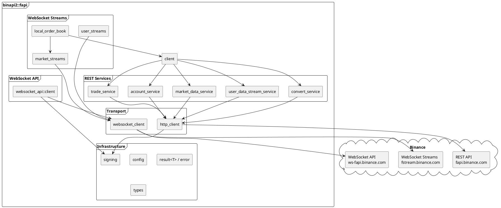
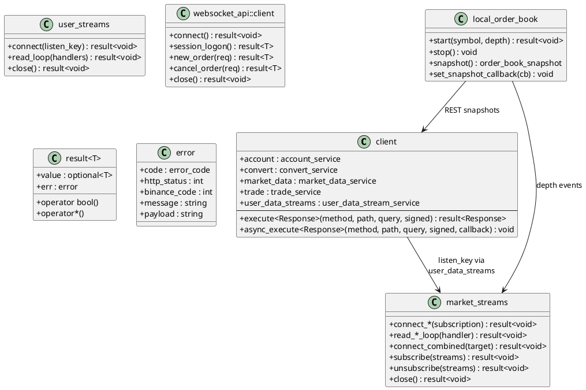
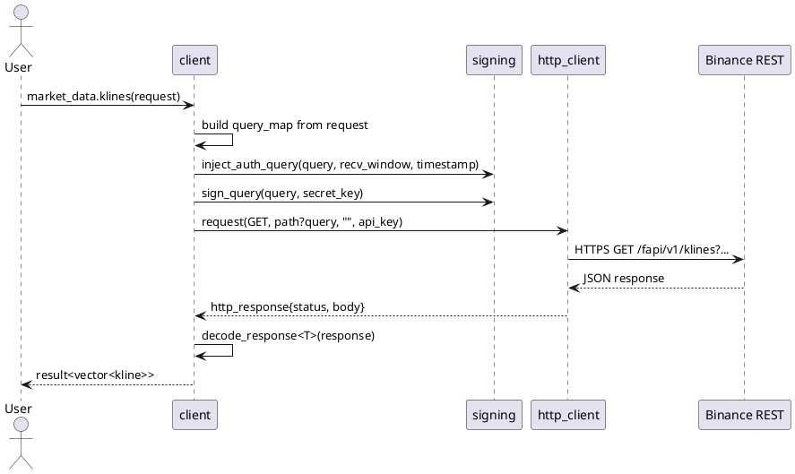
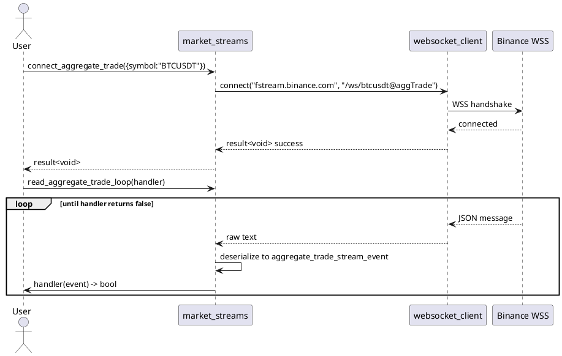
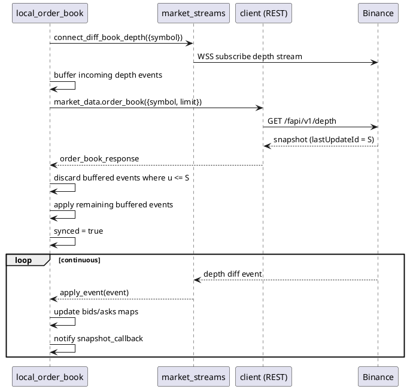
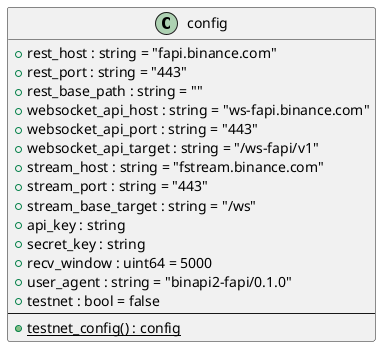
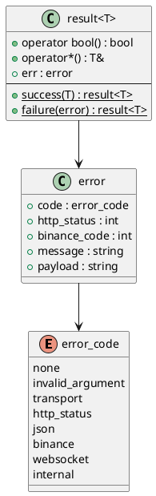

# binapi2 Design Documentation

C++ client library for **Binance USD-M Futures API**. Built on C++23, Boost.Beast/ASIO, OpenSSL, and Glaze JSON.

---

## Architecture Overview

---

## Component Diagram

---

## Request Flow

---

## Stream Lifecycle

---

## Local Order Book Sync

---

## Access Modes

Every method supports **synchronous** (returns `result<T>`) and **asynchronous** (takes `callback_type<T>`, invoked via `io_context`) access.

| Access Mode | Transport | Authentication | Latency | Use Case |
|---|---|---|---|---|
| REST Request | HTTPS | API key in header, HMAC-SHA256 signed query | Medium | Account queries, order placement, market data snapshots |
| WebSocket Stream | WSS | None (market) / Listen key (user) | Low | Real-time market data, account events |
| WebSocket API | WSS | HMAC-SHA256 per message | Lowest | Low-latency trading without HTTP overhead |
| Local Order Book | WSS + REST | None | Low | Synchronized local depth book |

---

## API Groups

### 1. Market Data Service (`rest::market_data_service`)

Public endpoints. No authentication required.

| Method | Data Provided | Return Type |
|---|---|---|
| `ping()` | Server connectivity check | `empty_response` |
| `server_time()` | Server timestamp (ms) | `server_time_response` |
| `exchange_info()` | Symbols, filters, rate limits, trading rules | `exchange_info_response` |
| `order_book(symbol, limit)` | Bid/ask depth snapshot | `order_book_response` |
| `recent_trades(symbol)` | Latest trades | `vector<recent_trade>` |
| `historical_trades(symbol)` | Older trades (needs API key) | `vector<recent_trade>` |
| `aggregate_trades(symbol)` | Compressed/aggregated trades | `vector<aggregate_trade>` |
| `klines(symbol, interval)` | OHLCV candlesticks | `vector<kline>` |
| `continuous_klines(pair, contract, interval)` | Perpetual contract klines | `vector<kline>` |
| `index_price_klines(pair, interval)` | Index price candlesticks | `vector<kline>` |
| `mark_price_klines(symbol, interval)` | Mark price candlesticks | `vector<kline>` |
| `premium_index_klines(symbol, interval)` | Premium index candlesticks | `vector<kline>` |
| `mark_price(symbol)` | Mark price + funding rate | `mark_price` |
| `mark_prices()` | All symbols mark prices | `vector<mark_price>` |
| `funding_rate_history()` | Historical funding rates | `vector<funding_rate_history_entry>` |
| `funding_rate_info()` | Next funding time & rate per symbol | `vector<funding_rate_info>` |
| `ticker_24hr(symbol)` | 24h price change statistics | `ticker_24hr` |
| `ticker_24hrs()` | All symbols 24h stats | `vector<ticker_24hr>` |
| `price_ticker(symbol)` | Latest price | `price_ticker` |
| `price_tickers()` | All latest prices | `vector<price_ticker>` |
| `price_ticker_v2(symbol)` | Latest price (v2 endpoint) | `price_ticker` |
| `price_tickers_v2()` | All latest prices (v2) | `vector<price_ticker>` |
| `book_ticker(symbol)` | Best bid/ask | `book_ticker` |
| `book_tickers()` | All symbols best bid/ask | `vector<book_ticker>` |
| `open_interest(symbol)` | Current open interest | `open_interest` |
| `open_interest_statistics(symbol, period)` | Historical open interest | `vector<open_interest_statistics_entry>` |
| `top_long_short_account_ratio(symbol, period)` | Top trader account ratio | `vector<long_short_ratio_entry>` |
| `top_trader_long_short_ratio(symbol, period)` | Top trader position ratio | `vector<long_short_ratio_entry>` |
| `long_short_ratio(symbol, period)` | Global long/short ratio | `vector<long_short_ratio_entry>` |
| `taker_buy_sell_volume(symbol, period)` | Taker buy/sell volume | `vector<taker_buy_sell_volume_entry>` |
| `basis(pair, contract, period)` | Spot-futures basis | `vector<basis_entry>` |
| `delivery_price(pair)` | Historical delivery prices | `vector<delivery_price_entry>` |
| `composite_index_info(symbol)` | Composite index details | `vector<composite_index_info>` |
| `index_constituents(symbol)` | Index component weights | `index_constituents_response` |
| `asset_index()` | Multi-asset mode index | `vector<asset_index>` |
| `insurance_fund()` | Insurance fund balance history | `insurance_fund_response` |
| `adl_risk()` | ADL risk percentile | `vector<adl_risk_entry>` |
| `rpi_depth(symbol)` | Restricted price index depth | `order_book_response` |
| `trading_schedule()` | Trading session schedule | `trading_schedule_response` |

### 2. Account Service (`rest::account_service`)

Signed endpoints. Requires API key + secret.

| Method | Data Provided | Return Type |
|---|---|---|
| `account_information()` | Full account state: balances, positions, margin | `account_information` |
| `balances()` | All asset balances | `vector<futures_account_balance>` |
| `position_risk(symbol?)` | Position details with PnL, liquidation price | `vector<position_risk>` |
| `account_config()` | Fee tier, permissions, multi-asset mode | `account_config_response` |
| `symbol_config(symbol?)` | Per-symbol leverage and margin settings | `vector<symbol_config_entry>` |
| `get_multi_assets_mode()` | Whether multi-asset margin is enabled | `multi_assets_mode_response` |
| `get_position_mode()` | Hedge mode vs one-way mode | `position_mode_response` |
| `income_history(type?, symbol?)` | Funding fees, realized PnL, commissions | `vector<income_history_entry>` |
| `leverage_brackets(symbol?)` | Leverage limits by notional tier | `vector<symbol_leverage_brackets>` |
| `commission_rate(symbol)` | Maker/taker commission rates | `commission_rate_response` |
| `rate_limit_order()` | Current order rate limit usage | `vector<rate_limit>` |
| `download_id_transaction(start, end)` | Start transaction history download | `download_id_response` |
| `download_link_transaction(id)` | Get transaction download link | `download_link_response` |
| `download_id_order(start, end)` | Start order history download | `download_id_response` |
| `download_link_order(id)` | Get order download link | `download_link_response` |
| `download_id_trade(start, end)` | Start trade history download | `download_id_response` |
| `download_link_trade(id)` | Get trade download link | `download_link_response` |
| `get_bnb_burn()` | BNB burn on interest status | `bnb_burn_status_response` |
| `toggle_bnb_burn(enabled)` | Enable/disable BNB interest burn | `bnb_burn_status_response` |
| `quantitative_rules(symbol?)` | Portfolio margin rules/indicators | `quantitative_rules_response` |
| `pm_account_info(asset)` | Portfolio margin account info | `pm_account_info_response` |

### 3. Trade Service (`rest::trade_service`)

Signed endpoints. Requires API key + secret.

| Method | Data Provided | Return Type |
|---|---|---|
| `new_order(request)` | Place an order | `order_response` |
| `test_order(request)` | Validate order without execution | `order_response` |
| `modify_order(request)` | Modify a pending order | `order_response` |
| `cancel_order(request)` | Cancel an order | `order_response` |
| `query_order(request)` | Get order details | `order_response` |
| `query_open_order(request)` | Get a single open order | `order_response` |
| `all_open_orders(symbol?)` | List open orders | `vector<order_response>` |
| `all_orders(symbol)` | Full order history | `vector<order_response>` |
| `batch_orders(orders)` | Place up to 5 orders at once | `vector<order_response>` |
| `modify_batch_orders(orders)` | Modify multiple orders | `vector<order_response>` |
| `cancel_batch_orders(request)` | Cancel multiple orders | `vector<order_response>` |
| `cancel_all_open_orders(symbol)` | Cancel all open orders for symbol | `code_msg_response` |
| `auto_cancel(symbol, countdown)` | Dead-man's switch auto-cancel | `auto_cancel_response` |
| `change_leverage(symbol, leverage)` | Set leverage | `change_leverage_response` |
| `change_margin_type(symbol, type)` | Isolated vs cross margin | `code_msg_response` |
| `change_position_mode(dual)` | One-way vs hedge mode | `code_msg_response` |
| `change_multi_assets(enabled)` | Toggle multi-asset margin | `code_msg_response` |
| `modify_isolated_margin(request)` | Adjust isolated position margin | `modify_isolated_margin_response` |
| `position_margin_history(symbol)` | Margin adjustment history | `vector<position_margin_history_entry>` |
| `position_risk_v3(symbol?)` | Position info (v3 format) | `vector<position_risk_v3>` |
| `adl_quantile(symbol?)` | Auto-deleverage ranking | `vector<adl_quantile_entry>` |
| `force_orders(symbol?)` | Liquidation order history | `vector<order_response>` |
| `account_trades(symbol)` | Executed trade history | `vector<account_trade_entry>` |
| `order_modify_history(request)` | Order modification history | `vector<order_response>` |
| `new_algo_order(request)` | Place conditional/algo order | `algo_order_response` |
| `cancel_algo_order(request)` | Cancel algo order | `code_msg_response` |
| `query_algo_order(request)` | Query algo order status | `algo_order_response` |
| `all_algo_orders(request)` | Algo order history | `vector<algo_order_response>` |
| `open_algo_orders()` | Current open algo orders | `vector<algo_order_response>` |
| `cancel_all_algo_orders()` | Cancel all algo orders | `code_msg_response` |
| `tradfi_perps(request?)` | TradFi perpetuals toggle | `code_msg_response` |

### 4. Convert Service (`rest::convert_service`)

Signed endpoints. Asset conversion between futures wallet assets.

| Method | Data Provided | Return Type |
|---|---|---|
| `get_quote(from, to, amount)` | Conversion quote with price | `convert_quote_response` |
| `accept_quote(quoteId)` | Execute the quoted conversion | `convert_accept_response` |
| `order_status(orderId)` | Check conversion status | `convert_order_status_response` |

### 5. User Data Stream Service (`rest::user_data_stream_service`)

Listen key management for user WebSocket streams.

| Method | Data Provided | Return Type |
|---|---|---|
| `start()` | Create a listen key (valid 60 min) | `listen_key_response` |
| `keepalive()` | Extend listen key validity | `listen_key_response` |
| `close()` | Revoke listen key | `empty_response` |

### 6. Market Streams (`streams::market_streams`)

Real-time WebSocket market data. No authentication.

| Stream | Method Pair | Event Type | Data Provided |
|---|---|---|---|
| Aggregate Trade | `connect_aggregate_trade` / `read_aggregate_trade_loop` | `aggregate_trade_stream_event` | Compressed trades: price, qty, time, side |
| Mark Price | `connect_mark_price` / `read_mark_price_loop` | `mark_price_stream_event` | Mark price, index price, funding rate |
| All Mark Prices | `connect_all_market_mark_price` / `read_all_market_mark_price_loop` | `all_market_mark_price_stream_event` | All symbols mark prices |
| Book Ticker | `connect_book_ticker` / `read_book_ticker_loop` | `book_ticker_stream_event` | Best bid/ask price and qty |
| All Book Tickers | `connect_all_book_tickers` / `read_all_book_tickers_loop` | `book_ticker_stream_event` | All symbols best bid/ask |
| Diff Depth | `connect_diff_book_depth` / `read_diff_book_depth_loop` | `depth_stream_event` | Incremental order book updates |
| Partial Depth | `connect_partial_book_depth` / `read_partial_book_depth_loop` | `depth_stream_event` | Top N levels snapshot (5/10/20) |
| RPI Diff Depth | `connect_rpi_diff_book_depth` / `read_rpi_diff_book_depth_loop` | `depth_stream_event` | Restricted price index depth diffs |
| Mini Ticker | `connect_mini_ticker` / `read_mini_ticker_loop` | `mini_ticker_stream_event` | Compact 24h stats (OHLC, volume) |
| All Mini Tickers | `connect_all_market_mini_tickers` / `read_all_market_mini_tickers_loop` | `all_market_mini_ticker_stream_event` | All symbols compact stats |
| Ticker | `connect_ticker` / `read_ticker_loop` | `ticker_stream_event` | Full 24h rolling stats |
| All Tickers | `connect_all_market_tickers` / `read_all_market_tickers_loop` | `all_market_ticker_stream_event` | All symbols full stats |
| Kline | `connect_kline` / `read_kline_loop` | `kline_stream_event` | Candlestick OHLCV updates |
| Continuous Kline | `connect_continuous_contract_kline` / `read_continuous_contract_kline_loop` | `continuous_contract_kline_stream_event` | Perpetual contract klines |
| Liquidation | `connect_liquidation_order` / `read_liquidation_order_loop` | `liquidation_order_stream_event` | Individual symbol liquidations |
| All Liquidations | `connect_all_market_liquidation_orders` / `read_all_market_liquidation_orders_loop` | `liquidation_order_stream_event` | All symbols liquidations |
| Composite Index | `connect_composite_index` / `read_composite_index_loop` | `composite_index_stream_event` | Index composition changes |
| Contract Info | `connect_contract_info` / `read_contract_info_loop` | `contract_info_stream_event` | Contract spec changes |
| Asset Index | `connect_asset_index` / `read_asset_index_loop` | `asset_index_stream_event` | Single asset index |
| All Asset Index | `connect_all_asset_index` / `read_all_asset_index_loop` | `all_asset_index_stream_event` | All asset indices |
| Trading Session | `connect_trading_session` / `read_trading_session_loop` | `trading_session_stream_event` | Session schedule changes |

**Combined stream management:**

| Method | Purpose |
|---|---|
| `connect_combined(target)` | Open multiplexed connection |
| `subscribe(streams)` | Dynamically add streams |
| `unsubscribe(streams)` | Remove streams |
| `list_subscriptions()` | List active stream names |
| `close()` | Disconnect |

### 7. User Streams (`streams::user_streams`)

Real-time account events. Requires listen key.

| Event | Handler Type | Data Provided |
|---|---|---|
| Account Update | `account_update_handler` | Balance changes, position updates, margin changes |
| Order Trade Update | `order_trade_update_handler` | Order fills, cancellations, expirations |
| Margin Call | `margin_call_handler` | Margin ratio warnings for positions |
| Listen Key Expired | `listen_key_expired_handler` | Key invalidation notification |
| Account Config Update | `account_config_update_handler` | Leverage or multi-asset mode changes |
| Trade Lite | `trade_lite_handler` | Lightweight trade fill notifications |
| Algo Order Update | `algo_order_update_handler` | Conditional/algo order status changes |
| Conditional Order Reject | `conditional_order_reject_handler` | Trigger rejection notifications |
| Grid Update | `grid_update_handler` | Grid strategy updates |
| Strategy Update | `strategy_update_handler` | Strategy status changes |

### 8. Local Order Book (`streams::local_order_book`)

Thread-safe synchronized local order book.

| Method | Purpose |
|---|---|
| `start(symbol, depth)` | Begin syncing: fetches REST snapshot, applies buffered WS diffs |
| `stop()` | Stop syncing |
| `snapshot()` | Get current book state (bids descending, asks ascending) |
| `set_snapshot_callback(cb)` | Receive notification on each update |

### 9. WebSocket API (`websocket_api::client`)

Low-latency trading via persistent WebSocket. HMAC-SHA256 signed per message.

| Method | Category | Data Provided |
|---|---|---|
| `connect()` | Session | Establish WSS connection |
| `session_logon()` | Session | Authenticate with API key |
| `close()` | Session | Disconnect |
| `account_status()` | Account | Full account info |
| `account_status_v2()` | Account | Account info (v2) |
| `account_balance()` | Account | Asset balances |
| `account_position()` | Account | Position details |
| `account_position_v2()` | Account | Position details (v2) |
| `new_order(request)` | Trade | Place order |
| `modify_order(request)` | Trade | Modify pending order |
| `cancel_order(request)` | Trade | Cancel order |
| `query_order(request)` | Trade | Query order status |
| `book_ticker(symbol?)` | Market | Best bid/ask |
| `ticker_price(symbol?)` | Market | Latest price |
| `algo_order_place(request)` | Algo | Place conditional order |
| `algo_order_cancel(request)` | Algo | Cancel conditional order |
| `user_data_stream_start()` | User Data | Create listen key |
| `user_data_stream_ping()` | User Data | Refresh listen key |
| `user_data_stream_stop()` | User Data | Revoke listen key |

---

## Configuration

---

## Error Handling

---

## Dependencies

| Dependency | Purpose | Type |
|---|---|---|
| Boost.ASIO | Async I/O, event loop | Required |
| Boost.Beast | HTTP/WebSocket protocol | Required |
| OpenSSL | TLS (HTTPS/WSS) + HMAC-SHA256 signing | Required |
| ZLIB | Response compression | Required |
| Glaze | Compile-time JSON serialization | Bundled (header-only) |
| DTF | Datetime formatting | Bundled (header-only) |

**Build:** CMake 3.10+, C++23 compiler.
