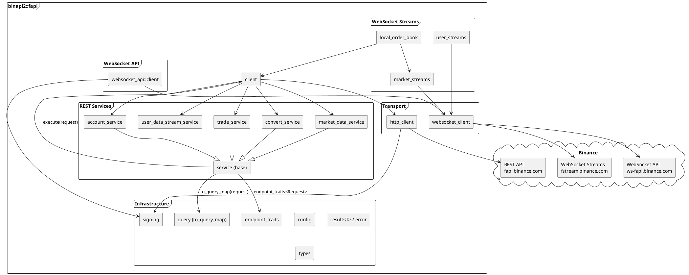
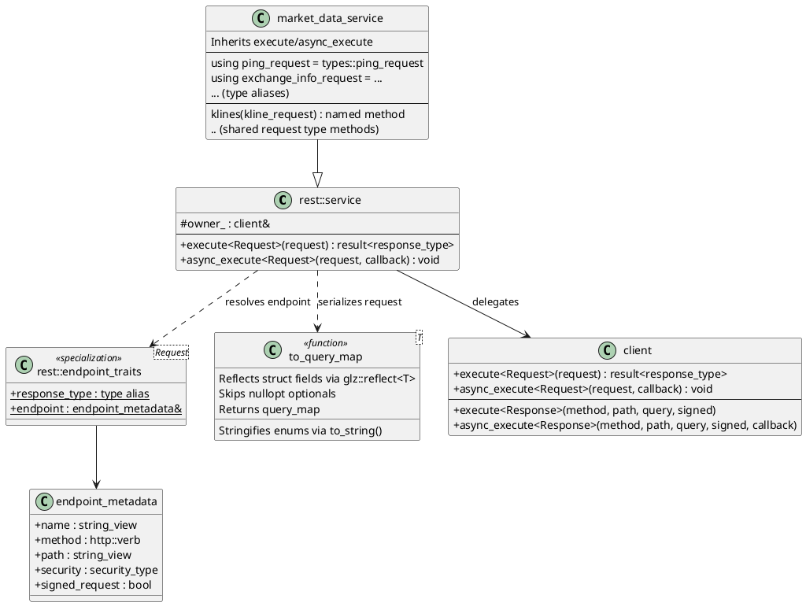
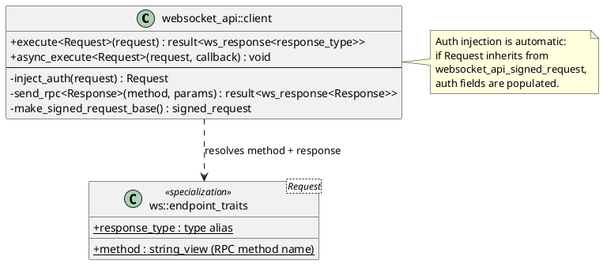
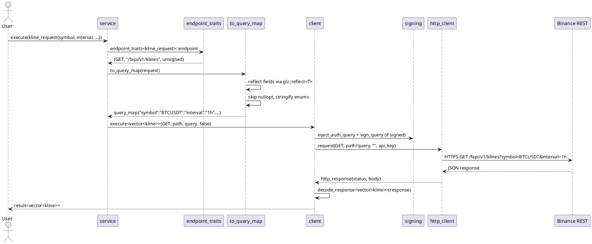
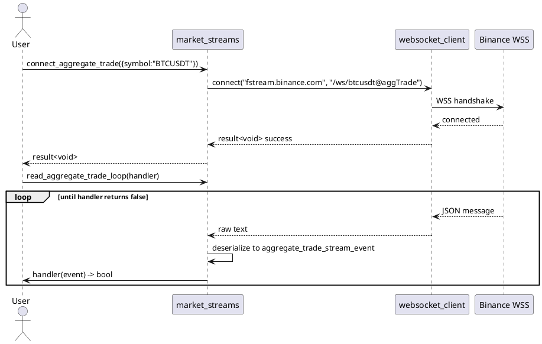
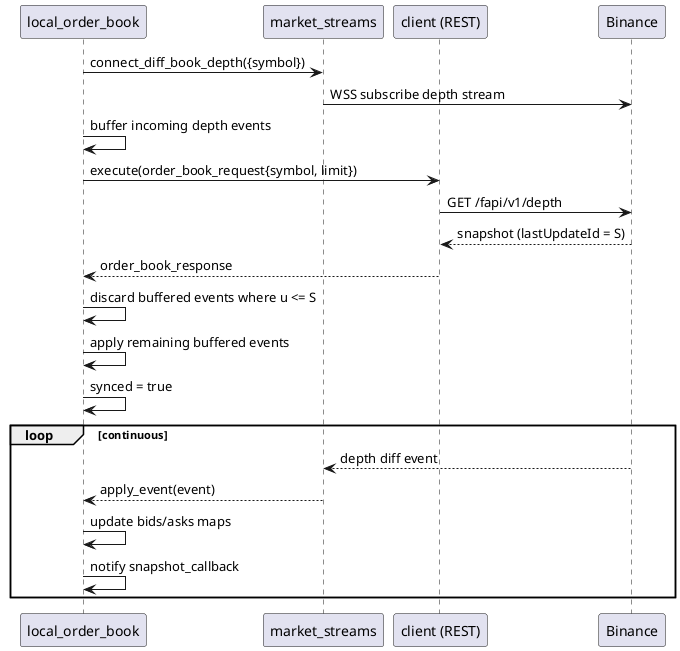
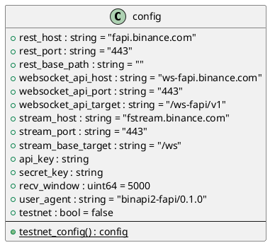
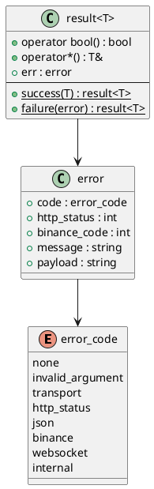

# binapi2 Design Documentation

C++ client library for **Binance USD-M Futures API**. Built on C++23, Boost.Beast/ASIO, OpenSSL, and Glaze JSON.

---

## Architecture Overview



---

## Generic Request Dispatch

The core design pattern: **request types carry all the information needed to dispatch an API call**.

### REST API



**How it works:**

1. `service::execute(request)` looks up `endpoint_traits<Request>` at compile time to get the endpoint metadata and response type
2. `to_query_map(request)` uses `glz::reflect<T>` to serialize the request struct fields into a `query_map`, skipping `std::optional` nullopts and converting enums via `to_string()`
3. `client::execute<Response>()` handles signing, query string encoding, HTTP transport, and JSON response deserialization

**Usage:**
```cpp
// Via service (grouped by domain):
auto result = client.market_data.execute(exchange_info_request{});
auto result = client.trade.execute(new_order_request{.symbol = "BTCUSDT", ...});

// Or directly on client:
auto result = client.execute(types::cancel_order_request{.symbol = "BTCUSDT", .orderId = 123});

// Async:
client.trade.async_execute(new_order_request{...}, [](auto result) { ... });
```

### WebSocket API



**How it works:**

1. `ws::client::execute(request)` looks up `ws::endpoint_traits<Request>` to get the RPC method name and response type
2. If the request type inherits from `websocket_api_signed_request`, auth fields (apiKey, timestamp, recvWindow, signature) are injected automatically
3. The request is serialized into a JSON-RPC envelope `{id, method, params}` and sent over the WebSocket connection

**Usage:**
```cpp
ws_client.execute(websocket_api_order_place_request{.symbol = "BTCUSDT", .side = "BUY", ...});
ws_client.execute(websocket_api_book_ticker_request{.symbol = "BTCUSDT"});
```

---

## Request Flow



---

## Stream Lifecycle



---

## Local Order Book Sync



---

## Type System

### Request → Endpoint Mapping

Request types with a 1:1 endpoint mapping have `endpoint_traits` (REST) or `ws::endpoint_traits` (WebSocket API) specializations. These are dispatched generically via `execute(request)`.

Shared request types (used by multiple endpoints) retain named service methods:

| Shared Type | Endpoints | Service |
|---|---|---|
| `kline_request` | klines, mark_price_klines, premium_index_klines | market_data |
| `futures_data_request` | open_interest_statistics, top_long_short_account_ratio, top_trader_long_short_ratio, long_short_ratio, taker_buy_sell_volume | market_data |
| `download_id_request` | download_id_transaction, download_id_order, download_id_trade | account |
| `download_link_request` | download_link_transaction, download_link_order, download_link_trade | account |
| `batch_orders_request` | batch_orders, modify_batch_orders | trade |

### Query Serialization

`to_query_map<T>(request)` uses compile-time reflection via `glz::reflect<T>` to automatically build URL query parameters from request struct fields:

- `std::string` → passed as-is
- `std::uint64_t`, `int` → `std::to_string()`
- `bool` → `"true"` / `"false"`
- fapi enums → `types::to_string()` (e.g., `order_side::buy` → `"BUY"`)
- `std::optional<T>` where value is nullopt → skipped entirely
- Works with both `glz::meta`-annotated and plain `reflectable` aggregates

---

## Access Modes

Every method supports **synchronous** (returns `result<T>`) and **asynchronous** (takes `callback_type<T>`, invoked via `io_context`) access.

| Access Mode | Transport | Authentication | Latency | Use Case |
|---|---|---|---|---|
| REST Request | HTTPS | API key in header, HMAC-SHA256 signed query | Medium | Account queries, order placement, market data snapshots |
| WebSocket Stream | WSS | None (market) / Listen key (user) | Low | Real-time market data, account events |
| WebSocket API | WSS | HMAC-SHA256 per message | Lowest | Low-latency trading without HTTP overhead |
| Local Order Book | WSS + REST | None | Low | Synchronized local depth book |

---

## Service Classes

Services inherit from `rest::service` which provides generic `execute(request)` / `async_execute(request, callback)`. Each service pulls request types from the `types` namespace via `using` declarations.

### 1. Market Data Service (`rest::market_data_service`)

Public endpoints. No authentication required.

Generic (via `execute`): `ping_request`, `server_time_request`, `exchange_info_request`, `order_book_request`, `recent_trades_request`, `aggregate_trades_request`, `continuous_kline_request`, `index_price_kline_request`, `book_ticker_request`, `price_ticker_request`, `ticker_24hr_request`, `mark_price_request`, `funding_rate_history_request`, `open_interest_request`, `historical_trades_request`, `basis_request`, `price_ticker_v2_request`, `delivery_price_request`, `composite_index_info_request`, `index_constituents_request`, `asset_index_request`, `insurance_fund_request`, `adl_risk_request`, `rpi_depth_request`, `trading_schedule_request`

Named methods: `klines`, `mark_price_klines`, `premium_index_klines` (shared `kline_request`); `open_interest_statistics`, `top_long_short_account_ratio`, `top_trader_long_short_ratio`, `long_short_ratio`, `taker_buy_sell_volume` (shared `futures_data_request`); `book_tickers`, `price_tickers`, `price_tickers_v2`, `ticker_24hrs`, `mark_prices`, `funding_rate_info` (parameterless)

### 2. Account Service (`rest::account_service`)

Signed endpoints.

Generic: `position_risk_request`, `symbol_config_request`, `income_history_request`, `leverage_bracket_request`, `commission_rate_request`, `toggle_bnb_burn_request`, `quantitative_rules_request`, `pm_account_info_request`

Named methods: `account_information`, `balances`, `account_config`, `get_multi_assets_mode`, `get_position_mode`, `rate_limit_order`, `get_bnb_burn` (parameterless); `download_id_*`, `download_link_*` (shared request types)

### 3. Trade Service (`rest::trade_service`)

Signed endpoints.

Generic: `new_order_request`, `modify_order_request`, `cancel_order_request`, `query_order_request`, `cancel_all_open_orders_request`, `auto_cancel_request`, `query_open_order_request`, `all_open_orders_request`, `all_orders_request`, `position_info_v3_request`, `adl_quantile_request`, `force_orders_request`, `account_trade_request`, `change_position_mode_request`, `change_multi_assets_mode_request`, `change_leverage_request`, `change_margin_type_request`, `modify_isolated_margin_request`, `position_margin_history_request`, `order_modify_history_request`, `new_algo_order_request`, `cancel_algo_order_request`, `query_algo_order_request`, `all_algo_orders_request`

Named methods: `test_order` (alias collision), `batch_orders`, `modify_batch_orders`, `cancel_batch_orders` (special serialization); `open_algo_orders`, `cancel_all_algo_orders`, `tradfi_perps` (parameterless)

### 4. Convert Service (`rest::convert_service`)

Fully generic: `quote_request`, `accept_request`, `order_status_request`

### 5. User Data Stream Service (`rest::user_data_stream_service`)

Named methods: `start`, `keepalive`, `close`

### 6. WebSocket API (`websocket_api::client`)

Generic (via `execute`): `order_place_request`, `order_query_request`, `order_cancel_request`, `order_modify_request`, `position_request`, `book_ticker_request`, `price_ticker_request`, `algo_order_place_request`, `algo_order_cancel_request`

Named methods: `session_logon`, `account_status/v2`, `account_balance`, `account_position_v2` (shared type), `user_data_stream_start/ping/stop` (shared type), `connect`, `close`

### 7. Market Streams (`streams::market_streams`)

Real-time WebSocket market data. Connect/read loop pattern per stream type. See [implementation_status.md] for full stream list.

### 8. User Streams (`streams::user_streams`)

Real-time account events via listen key. Multiplexed event handlers for order updates, balance changes, margin calls, etc.

### 9. Local Order Book (`streams::local_order_book`)

Thread-safe synchronized local order book. Combines REST snapshots with WebSocket depth diffs.

---

## Configuration



---

## Error Handling



---

## Dependencies

| Dependency | Purpose | Type |
|---|---|---|
| Boost.ASIO | Async I/O, event loop | Required |
| Boost.Beast | HTTP/WebSocket protocol | Required |
| OpenSSL | TLS (HTTPS/WSS) + HMAC-SHA256 signing | Required |
| ZLIB | Response compression | Required |
| Glaze | Compile-time JSON serialization + struct reflection | Bundled (header-only) |
| DTF | Datetime formatting | Bundled (header-only) |

**Build:** CMake 3.10+, C++23 compiler.

[implementation_status.md]: /docs/implementation_status.md
