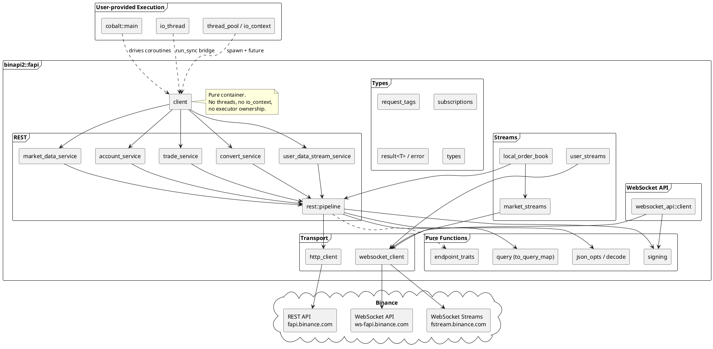
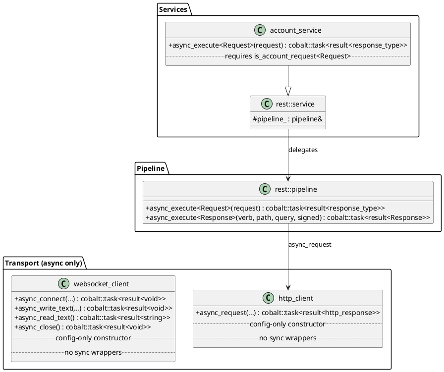
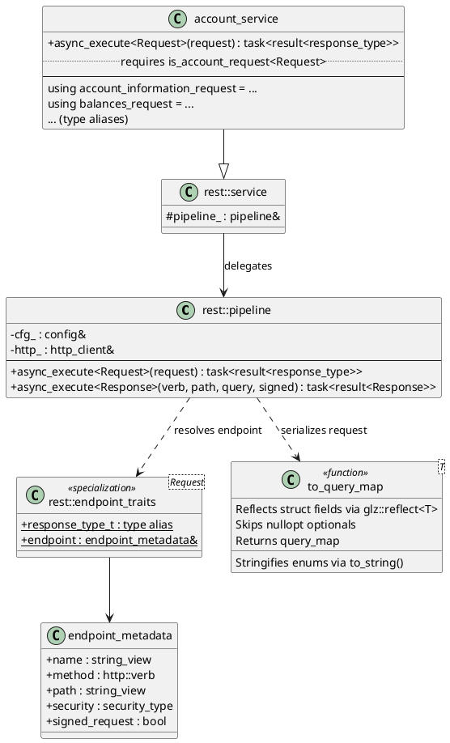
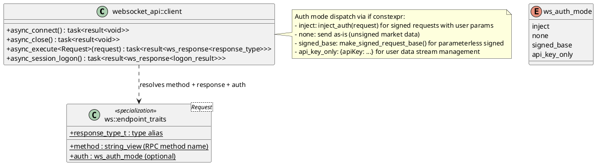
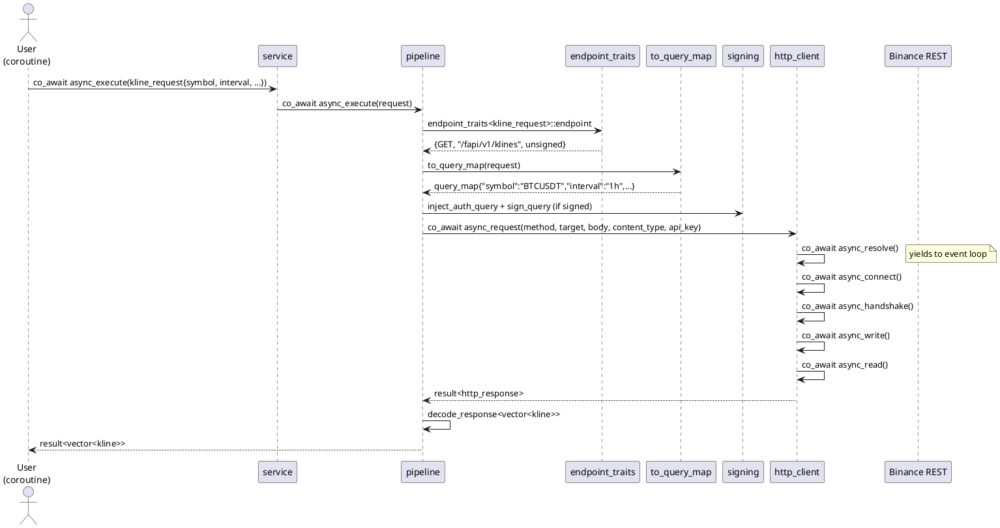
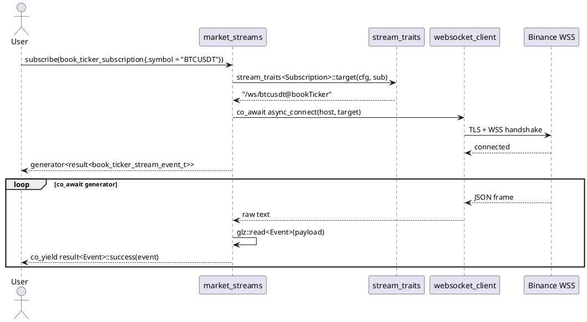
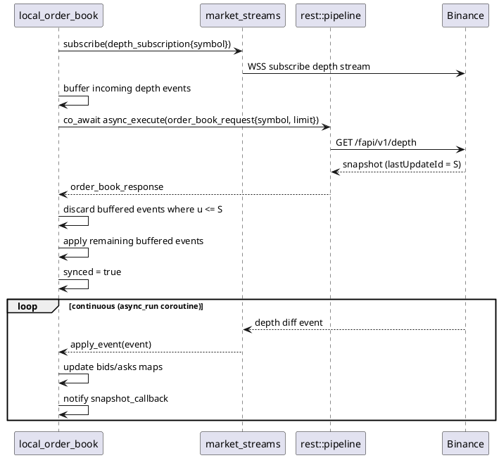
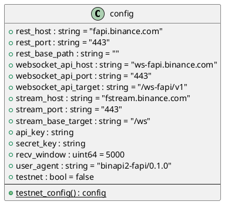
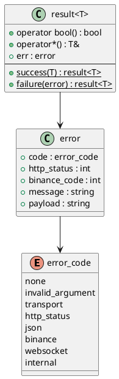

# binapi2 Design Documentation

C++ client library for **Binance USD-M Futures API**. Built on C++23, Boost.Beast/ASIO/Cobalt, OpenSSL, and Glaze JSON.

---

## Architecture Overview



### Layer Architecture

| Layer | Components | Owns executor? |
|---|---|---|
| **1. Pure functions** | `signing.hpp`, `query.hpp`, `json_opts.hpp`, `detail/decode.hpp` | No |
| **2. Async I/O** | `transport::http_client`, `transport::websocket_client` | No -- uses `this_coro::executor` |
| **3. Protocol** | `rest::pipeline`, `websocket_api::client`, `streams::market_streams`, `streams::user_streams` | No |
| **4. Execution** | `detail::io_thread`, `cobalt::main`, `thread_pool`, manual `io_context` | Yes -- user-provided |
| **5. Facade** | `client` | No -- pure container |

---

## Async Model

All I/O is built on **Boost.Cobalt** C++20 coroutines. Every method returns
`cobalt::task<result<T>>`. There are no sync wrappers anywhere in the library.



**Transport**: `http_client::async_request()` uses `co_await` at each I/O step
(resolve, connect, TLS handshake, write, read) -- non-blocking, yields to the event
loop between steps.

**No callbacks**: the old `callback_type<T> = std::function<void(result<T>)>` pattern
is removed. Async methods return `cobalt::task<result<T>>` which is awaitable.

**No sync wrappers**: there are no `execute()` methods that wrap async. Bridging to
sync is done by the user via `io_thread::run_sync()` or `cobalt::spawn + use_future`.

**Usage:**
```cpp
// Async (in cobalt::main):
boost::cobalt::main co_main(int, char*[]) {
    fapi::client c(cfg);
    auto result = co_await c.market_data.async_execute(exchange_info_request{});
    co_return 0;
}

// Sync bridge (via io_thread):
fapi::detail::io_thread io;
fapi::client c(cfg);
auto result = io.run_sync(c.market_data.async_execute(exchange_info_request{}));
```

---

## Generic Request Dispatch

The core design pattern: **request types carry all the information needed to dispatch
an API call**.

### REST API



**How it works:**

1. `service::async_execute(request)` is constrained by a per-service concept
   (e.g., `is_account_request<Request>`) that checks the request type's tag
2. Delegates to `pipeline::async_execute(request)` which looks up
   `endpoint_traits<Request>` at compile time
3. `to_query_map(request)` uses `glz::reflect<T>` to serialize the request struct
   fields into a `query_map`
4. Pipeline handles signing, query string encoding, HTTP transport, and JSON
   response deserialization

**Service concepts and tags:** Each request type carries a tag from `request_tags.hpp`
(e.g., `rest_account_tag`, `rest_market_data_tag`). Service tags live in
`endpoint_traits` -- not in request structs -- because glaze reflection breaks with
struct inheritance/using declarations.

### WebSocket API



`async_execute` is the single generic entry point. Auth mode is resolved at compile time
from `ws::endpoint_traits`. `session_logon` is the only named method (custom auth flow
that cannot use the generic dispatch).

---

## Request Flow (Async)



---

## Stream Architecture

### Generator Pattern (recommended)

Streams use `cobalt::generator` for typed async iteration:



`stream_traits<Subscription>` maps subscription types to target URLs and event types
at compile time. The generator yields `result<Event>` until an error or disconnect.

### User Data Streams

User streams return a `cobalt::generator<result<user_stream_event_t>>` where
`user_stream_event_t` is a `std::variant` of 10 event types:

```cpp
auto stream = c.user_streams().subscribe(listen_key);
while (stream) {
    auto event = co_await stream;
    if (!event) break;
    std::visit(overloaded{
        [](const order_trade_update_event_t& e) { /* ... */ },
        [](const account_update_event_t& e) { /* ... */ },
        [](const auto&) {}
    }, *event);
}
```

### Local Order Book



`local_order_book::async_run(symbol, depth_limit)` is a coroutine that runs the
entire sync algorithm. It takes references to `market_streams` and `rest::pipeline`.

---

## Type System

### Request -> Endpoint Mapping

Request types with a 1:1 endpoint mapping have `endpoint_traits` (REST) or
`ws::endpoint_traits` (WebSocket API) specializations. These are dispatched generically
via `async_execute(request)`.

Shared request types (used by multiple endpoints) retain named service methods:

| Shared Type | Endpoints | Service |
|---|---|---|
| `kline_request` | klines, mark_price_klines, premium_index_klines | market_data |
| `futures_data_request` | open_interest_statistics, top_long_short_account_ratio, top_trader_long_short_ratio, long_short_ratio, taker_buy_sell_volume | market_data |
| `download_id_request` | download_id_transaction, download_id_order, download_id_trade | account |
| `download_link_request` | download_link_transaction, download_link_order, download_link_trade | account |
| `batch_orders_request` | batch_orders, modify_batch_orders | trade |

### Query Serialization

`to_query_map<T>(request)` uses compile-time reflection via `glz::reflect<T>` to
automatically build URL query parameters from request struct fields:

- `std::string` -> passed as-is
- `std::uint64_t`, `int` -> `std::to_string()`
- `bool` -> `"true"` / `"false"`
- fapi enums -> `types::to_string()` (e.g., `order_side::buy` -> `"BUY"`)
- `std::optional<T>` where value is nullopt -> skipped entirely
- Works with both `glz::meta`-annotated and plain `reflectable` aggregates

---

## Access Modes

All methods are async-only (`cobalt::task<result<T>>`). Sync access is achieved via
user-provided bridging (e.g., `io_thread::run_sync()`).

| Access Mode | Transport | Authentication | Latency | Use Case |
|---|---|---|---|---|
| REST Request | HTTPS | API key in header, HMAC-SHA256 signed query | Medium | Account queries, order placement, market data snapshots |
| WebSocket Stream | WSS | None (market) / Listen key (user) | Low | Real-time market data, account events |
| WebSocket API | WSS | HMAC-SHA256 per message (4 auth modes) | Lowest | Low-latency trading without HTTP overhead |
| Local Order Book | WSS + REST | None | Low | Synchronized local depth book |

---

## Service Classes

Services inherit from `rest::service` which holds a `pipeline&` reference. Each
derived service provides a constrained `async_execute` that only accepts request types
tagged for that service (via concepts like `is_account_request`, `is_market_data_request`).

### 1. Market Data Service (`rest::market_data_service`)

Public endpoints. No authentication required.

Generic (via `async_execute`): `ping_request`, `server_time_request`,
`exchange_info_request`, `order_book_request`, `recent_trades_request`,
`aggregate_trades_request`, `continuous_kline_request`, `index_price_kline_request`,
`book_ticker_request`, `price_ticker_request`, `ticker_24hr_request`,
`mark_price_request`, `funding_rate_history_request`, `open_interest_request`,
`historical_trades_request`, `basis_request`, `price_ticker_v2_request`,
`delivery_price_request`, `composite_index_info_request`, `index_constituents_request`,
`asset_index_request`, `insurance_fund_request`, `adl_risk_request`,
`rpi_depth_request`, `trading_schedule_request`

Parameterless request types: `balances_request_t`, `klines_request_t`, etc.
Named methods for shared request types: `klines`, `mark_price_klines`,
`premium_index_klines`, `open_interest_statistics`, etc.

### 2. Account Service (`rest::account_service`)

Signed endpoints.

Generic: `account_information_request`, `balances_request`, `account_config_request`,
`position_risk_request`, `symbol_config_request`, `income_history_request`,
`leverage_bracket_request`, `commission_rate_request`, `get_multi_assets_mode_request`,
`get_position_mode_request`, `rate_limit_order_request`, `get_bnb_burn_request`,
`toggle_bnb_burn_request`, `quantitative_rules_request`, `pm_account_info_request`,
`download_id_*_request`, `download_link_*_request`

### 3. Trade Service (`rest::trade_service`)

Signed endpoints.

Generic: `new_order_request`, `modify_order_request`, `cancel_order_request`,
`query_order_request`, `cancel_all_open_orders_request`, `auto_cancel_request`,
`query_open_order_request`, `all_open_orders_request`, `all_orders_request`,
`position_info_v3_request`, `adl_quantile_request`, `force_orders_request`,
`account_trade_request`, `change_position_mode_request`,
`change_multi_assets_mode_request`, `change_leverage_request`,
`change_margin_type_request`, `modify_isolated_margin_request`,
`position_margin_history_request`, `order_modify_history_request`,
`new_algo_order_request`, `cancel_algo_order_request`, `query_algo_order_request`,
`all_algo_orders_request`

### 4. Convert Service (`rest::convert_service`)

Fully generic: `quote_request`, `accept_request`, `order_status_request`

### 5. User Data Stream Service (`rest::user_data_stream_service`)

REST management of listen keys: `async_start`, `async_keepalive`, `async_close`

### 6. WebSocket API (`websocket_api::client`)

Generic (via `async_execute`): `order_place_request`, `order_query_request`,
`order_cancel_request`, `order_modify_request`, `position_request`,
`book_ticker_request`, `price_ticker_request`, `algo_order_place_request`,
`algo_order_cancel_request`, `account_status_request`, `account_status_v2_request`,
`account_balance_request`, `user_data_stream_start_request`,
`user_data_stream_ping_request`, `user_data_stream_stop_request`

Named methods: `async_session_logon` (custom auth flow), `async_connect`, `async_close`

### 7. Market Streams (`streams::market_streams`)

Real-time WebSocket market data via generator pattern:
- `subscribe(subscription)` -> `cobalt::generator<result<Event>>`
- `async_connect(subscription)` + `async_read_event<Event>()` for typed connect/read
- `async_connect(target)` + `async_read_text()` for low-level access

### 8. User Streams (`streams::user_streams`)

Real-time account events:
- `subscribe(listen_key)` -> `cobalt::generator<result<user_stream_event_t>>`
- `async_connect(listen_key)` + `async_read_text()` for low-level access

### 9. Local Order Book (`streams::local_order_book`)

Async locally maintained order book:
- `async_run(symbol, depth_limit)` -> `cobalt::task<result<void>>`
- Takes `market_streams&` and `rest::pipeline&` references
- Thread-safe snapshot via `snapshot()` method

---

## Configuration



---

## Error Handling



---

## Dependencies

| Dependency | Purpose | Type |
|---|---|---|
| Boost.ASIO | Async I/O, event loop | Required |
| Boost.Beast | HTTP/WebSocket protocol | Required |
| Boost.Cobalt | C++20 coroutines (async transport) | Required |
| OpenSSL | TLS (HTTPS/WSS) + HMAC-SHA256 signing | Required |
| ZLIB | Response compression | Required |
| Glaze | Compile-time JSON serialization + struct reflection | Bundled (header-only) |
| DTF | Datetime formatting | Bundled (header-only) |

**Build:** CMake 3.10+, C++23 compiler, Boost 1.84+.

[implementation_status.md]: /docs/binapi2/implementation_status.md
