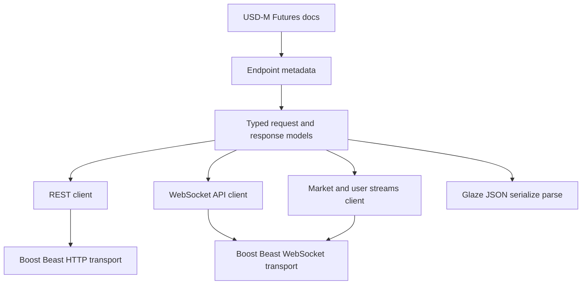

# binapi2 USD-M Futures implementation plan

## Goal

Implement a new USD-M Futures client library under [`include/binapi2/umf`](/include/binapi2/umf), [`src/binapi2/umf`](/src/binapi2/umf), and [`examples/binapi2/umf`](/examples/binapi2/umf).

The new library should stay parallel to the original Spot-focused [`binapi`](/) design from [`/README.md`](/README.md:1) and [`/CMakeLists.txt`](/CMakeLists.txt:1), keep the networking stack centered on Boost.Asio and Boost.Beast, but replace flat JSON document handling with Glaze-based full C++ object serialization and parsing.

The implementation scope includes the entire USD-M Futures docs tree under [`/docs/api/usds-margined-futures/md/developers.binance.com/docs/derivatives/usds-margined-futures`](/docs/api/usds-margined-futures/md/developers.binance.com/docs/derivatives/usds-margined-futures), including REST APIs, websocket API request-response RPC, websocket market streams, user-data streams, and Convert.

## Scope boundaries

### In scope

- all documented USD-M Futures REST endpoints
- all documented USD-M Futures websocket API RPC methods
- all documented websocket market streams
- all documented user-data stream lifecycle endpoints and event payloads
- all documented Convert endpoints in the USD-M Futures docs tree
- strongly typed request and response models for full JSON documents
- request signing, timestamp handling, recvWindow handling, and auth helpers
- build integration in [`deps/CMakeLists.txt`](/deps/CMakeLists.txt)
- examples in [`examples/binapi2/umf`](/examples/binapi2/umf)

### Out of scope for the first delivery

- Spot migration or refactoring of the original [`binapi`](/)
- code generation from scraped docs during the first implementation pass
- cross-product abstractions spanning Spot, Margin, and Futures unless required by immediate reuse
- preserving the original flatjson runtime model in the new client

## Design principles

1. Keep the public mental model close to the current [`binapi`](/) split between REST and websocket clients.
2. Replace ad hoc flat JSON extraction with typed request and response document models.
3. Centralize Binance protocol metadata so endpoint paths, security type, HTTP method, and rate-limit annotations are not duplicated in handwritten transport code.
4. Separate protocol typing from transport mechanics so endpoint coverage can scale without transport churn.
5. Preserve synchronous and asynchronous usage styles where practical, while making async composition explicit and type-safe.
6. Prefer focused files grouped by domain such as market-data, trade, account, convert, and streams instead of one monolithic header.

## Proposed directory layout

```text
/
├── include/binapi2/umf/
│   ├── client.hpp
│   ├── config.hpp
│   ├── error.hpp
│   ├── result.hpp
│   ├── time.hpp
│   ├── signing.hpp
│   ├── transport/
│   │   ├── http_client.hpp
│   │   ├── websocket_client.hpp
│   │   ├── session_base.hpp
│   │   └── ssl_context.hpp
│   ├── rest/
│   │   ├── market_data.hpp
│   │   ├── account.hpp
│   │   ├── trade.hpp
│   │   ├── convert.hpp
│   │   ├── user_data_streams.hpp
│   │   └── generated_endpoints.hpp
│   ├── websocket_api/
│   │   ├── client.hpp
│   │   ├── methods.hpp
│   │   └── generated_methods.hpp
│   ├── streams/
│   │   ├── market_streams.hpp
│   │   ├── user_streams.hpp
│   │   └── subscriptions.hpp
│   └── types/
│       ├── common.hpp
│       ├── enums.hpp
│       ├── market_data.hpp
│       ├── account.hpp
│       ├── trade.hpp
│       ├── convert.hpp
│       ├── websocket_api.hpp
│       └── streams.hpp
├── src/binapi2/umf/
│   ├── client.cpp
│   ├── signing.cpp
│   ├── transport/*.cpp
│   ├── rest/*.cpp
│   ├── websocket_api/*.cpp
│   ├── streams/*.cpp
│   └── generated/*.cpp
└── examples/binapi2/umf/
    ├── rest_ping.cpp
    ├── rest_exchange_info.cpp
    ├── rest_new_order.cpp
    ├── websocket_api_session_logon.cpp
    ├── stream_book_depth.cpp
    └── user_stream_listen_key.cpp
```

## Architecture

### Layer model



### Main components

#### Transport layer

- [`http_client.hpp`](/include/binapi2/umf/transport/http_client.hpp) will wrap HTTPS request execution over Boost.Beast.
- [`websocket_client.hpp`](/include/binapi2/umf/transport/websocket_client.hpp) will wrap websocket handshake, reads, writes, ping handling, reconnect hooks, and close semantics.
- Shared SSL and resolver setup should live behind [`ssl_context.hpp`](/include/binapi2/umf/transport/ssl_context.hpp) and [`session_base.hpp`](/include/binapi2/umf/transport/session_base.hpp).
- Transport should not know domain-specific JSON schema, only typed serialization callbacks and metadata.

#### Endpoint metadata layer

- Every endpoint and websocket method gets a metadata descriptor with:
  - logical name
  - HTTP method or websocket method name
  - path
  - security type such as none, market-data, user-data, trade
  - whether signing is required
  - whether timestamp is required
  - whether recvWindow is allowed
  - request type
  - response type
- This metadata should drive request building and reduce handwritten duplication.
- Generated metadata declarations can live in [`generated_endpoints.hpp`](/include/binapi2/umf/rest/generated_endpoints.hpp) and [`generated_methods.hpp`](/include/binapi2/umf/websocket_api/generated_methods.hpp).

#### Type system

- Define plain C++ structs for every documented request, response, and event payload.
- Group types by domain in [`types/`](/include/binapi2/umf/types).
- Add Glaze reflection metadata adjacent to each type or in companion traits blocks.
- Use explicit optionality for omitted fields and preserve Binance field names through Glaze mapping.
- Standardize shared wrappers for:
  - server time responses
  - rate-limit arrays
  - price and quantity strings
  - symbol filters
  - order identifiers
  - position snapshots
  - account balance snapshots
  - websocket envelope messages

#### REST client layer

- Provide a main REST facade in [`client.hpp`](/include/binapi2/umf/client.hpp) with domain subclients or grouped member functions.
- Maintain parity with the original style where a caller can instantiate one authenticated client and invoke typed methods.
- Support both synchronous and asynchronous calls, but drive both through one typed request pipeline.
- Signed endpoints should automatically append timestamp, recvWindow, and HMAC signature.

#### WebSocket API RPC layer

- Implement request-response websocket API support separately from push-stream subscriptions.
- Maintain typed outbound method structs and typed inbound result or error envelopes.
- Correlate replies by request id.
- Support session logon and authenticated methods.
- Expose a dispatcher that parses whole inbound frames into typed envelopes with Glaze.

#### Streaming layer

- Implement market streams and user-data streams as persistent websocket sessions.
- Each subscription helper should expose typed event callbacks rather than raw JSON strings.
- Support combined and raw stream addressing if the docs allow both.
- User-data streams need listen-key lifecycle helpers from REST plus event decoders in streams.

## Public API direction

### REST style

- top-level client object configured with host, port, API key, secret key, recvWindow, and testnet switch
- typed request structs passed into methods
- typed result structs returned from methods
- non-throwing result wrapper for transport and Binance errors

Example target shape:

```cpp
binapi2::umf::client client{cfg};
auto result = client.new_order(binapi2::umf::types::new_order_request{...});
```

### Websocket API style

- dedicated client object for RPC over websocket
- typed `send` or named method helpers
- typed callback registration for responses and push events

### Stream style

- dedicated stream manager for market and user streams
- one helper per documented stream family
- typed callbacks receiving decoded event structs

## Serialization strategy with Glaze

### Request serialization

- REST requests should serialize typed request structs into query parameters or JSON bodies depending on endpoint requirements.
- For query-string endpoints, use metadata-driven extraction of fields from typed structs into canonical Binance query ordering before signing.
- For JSON-body websocket API methods, use Glaze to serialize the full typed request document.

### Response parsing

- Parse full response bodies into typed C++ structs with Glaze.
- Normalize Binance error documents into a shared error type.
- Preserve unknown-field tolerance where useful, but fail clearly on schema mismatches during development.

### Type conventions

- keep Binance decimal values as strings by default unless a clear numeric wrapper type is introduced
- represent timestamps as integral milliseconds unless the API requires another format
- use enums for documented closed sets such as order side, position side, margin type, time in force, working type, contract type
- use `std::optional` for conditionally present fields

## Endpoint coverage strategy

The full scope is too large for a single handwritten pass without structure. Implementation should be staged by protocol shape, not by arbitrary file order.

### Phase 1: shared infrastructure

- config, error, result, signing, timestamp, HTTP transport, websocket transport, SSL helpers
- common Glaze helpers and shared primitive types
- endpoint metadata model

### Phase 2: high-value market-data and account base

- connectivity, time, exchange info, ping
- market-data REST endpoints
- user-data stream lifecycle endpoints
- basic market streams

### Phase 3: trade and account coverage

- order entry, cancel, modify, query, batch operations
- position and account endpoints
- leverage and margin operations

### Phase 4: websocket API RPC coverage

- authenticated session setup
- request-response methods by domain
- correlated response handling

### Phase 5: Convert and remaining long-tail endpoints

- quote and order conversion flows
- remaining administrative and less frequently used endpoints

### Phase 6: example and validation completion

- examples across REST, websocket API, and streams
- compile validation and smoke coverage

## Implementation work breakdown

### 1. Build integration

- update [`deps/CMakeLists.txt`](/deps/CMakeLists.txt) to expose [`/`](/) and [`deps/glaze`](/deps/glaze) in a way the submodule library can consume cleanly
- extend [`/CMakeLists.txt`](/CMakeLists.txt) with a new [`binapi2`](/CMakeLists.txt) target or a dedicated [`binapi2_umf`](/CMakeLists.txt) library target
- keep original [`binapi`](/) target intact to avoid breaking current consumers
- add example targets under [`examples/binapi2/umf`](/examples/binapi2/umf)

### 2. Foundational headers and source files

- create config, error, result, signing, time, transport, and common type headers
- create minimal `.cpp` implementations for transport and signing
- define namespace layout under `binapi2::umf`

### 3. Shared type library

- define common enums and primitives first
- define shared envelopes and reusable structs next
- then add domain-specific request and response structs
- add Glaze reflection for each type as it lands

### 4. REST endpoint framework

- implement a typed request executor that accepts endpoint metadata and request structs
- implement auth injection and signature generation
- implement response decoding and error mapping
- layer domain-specific convenience methods on top

### 5. WebSocket API framework

- implement websocket session start, auth logon, outbound method dispatch, inbound frame parse, request id correlation, and error propagation
- add domain method wrappers grouped by account, trade, and market-data RPC sections

### 6. Stream framework

- implement raw websocket market stream session
- implement subscription path builders
- implement event parser registry from stream name to typed event
- implement user-data stream session using REST listen-key management plus websocket event decoding

### 7. Endpoint and stream rollout

- cover all docs sections in this order:
  - [`market-data/rest-api`](/docs/api/usds-margined-futures/md/developers.binance.com/docs/derivatives/usds-margined-futures/market-data/rest-api)
  - [`websocket-market-streams`](/docs/api/usds-margined-futures/md/developers.binance.com/docs/derivatives/usds-margined-futures/websocket-market-streams)
  - [`user-data-streams`](/docs/api/usds-margined-futures/md/developers.binance.com/docs/derivatives/usds-margined-futures/user-data-streams)
  - [`account/rest-api`](/docs/api/usds-margined-futures/md/developers.binance.com/docs/derivatives/usds-margined-futures/account/rest-api)
  - [`trade/rest-api`](/docs/api/usds-margined-futures/md/developers.binance.com/docs/derivatives/usds-margined-futures/trade/rest-api)
  - [`account/websocket-api`](/docs/api/usds-margined-futures/md/developers.binance.com/docs/derivatives/usds-margined-futures/account/websocket-api)
  - [`trade/websocket-api`](/docs/api/usds-margined-futures/md/developers.binance.com/docs/derivatives/usds-margined-futures/trade/websocket-api)
  - [`market-data/websocket-api`](/docs/api/usds-margined-futures/md/developers.binance.com/docs/derivatives/usds-margined-futures/market-data/websocket-api)
  - [`convert`](/docs/api/usds-margined-futures/md/developers.binance.com/docs/derivatives/usds-margined-futures/convert)

### 8. Examples

- one unauthenticated REST example
- one authenticated REST trading example using testnet-safe flow where possible
- one websocket API RPC example
- one market stream example
- one user-data stream example

### 9. Validation

- compile the new library target and example targets
- add focused parser and serializer tests for representative payloads
- add signing tests using known Binance examples if present in docs
- add smoke tests for endpoint metadata coverage to detect undocumented omissions in the implementation inventory

## Risk areas and mitigations

### Risk: enormous endpoint surface

Mitigation:

- use endpoint metadata tables and shared request execution path
- group by domain and protocol shape
- track coverage explicitly against docs directories

### Risk: request field shape mismatches

Mitigation:

- define request structs directly from docs examples
- add round-trip serialization tests for representative payloads
- keep optional fields explicit and avoid hidden defaults

### Risk: websocket API and push streams have different semantics

Mitigation:

- keep RPC websocket and push-stream websocket in separate client layers even if they share transport internals

### Risk: CMake coupling between top-level repo and submodule

Mitigation:

- keep new CMake entry points additive
- avoid changing existing original [`binapi`](/) target behavior

## Acceptance criteria

- [`binapi2::umf`](/include/binapi2/umf) exists as a new typed client library parallel to the original [`binapi`](/)
- Glaze is used for typed request serialization and response parsing across REST and websocket APIs
- all documented USD-M Futures REST endpoints are represented by typed methods and types
- all documented websocket API RPC methods are represented by typed methods and types
- all documented websocket market streams and user-data events are represented by typed subscriptions and event structs
- Convert support is included
- examples build and demonstrate each protocol family
- build integration is present through [`deps/CMakeLists.txt`](/deps/CMakeLists.txt)

## Recommended execution order for [`💻 Code`](code) mode

1. Add CMake scaffolding and empty target structure.
2. Add transport, config, error, result, signing, and shared primitives.
3. Add common typed JSON helpers with Glaze.
4. Implement REST execution pipeline.
5. Implement core market-data REST plus market streams.
6. Implement account and trade REST.
7. Implement websocket API RPC layer.
8. Implement Convert.
9. Add examples and validation.

## Handoff note

Implementation should optimize for coverage completeness and internal regularity, not for minimal file count. The core architectural success criterion is that adding the next Binance endpoint becomes primarily a typing and metadata task rather than a transport rewrite.
